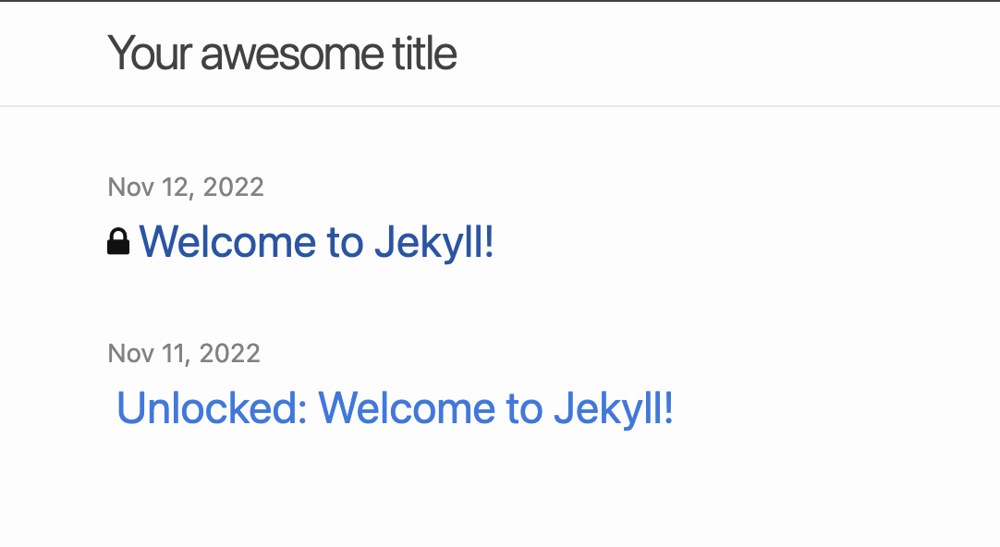
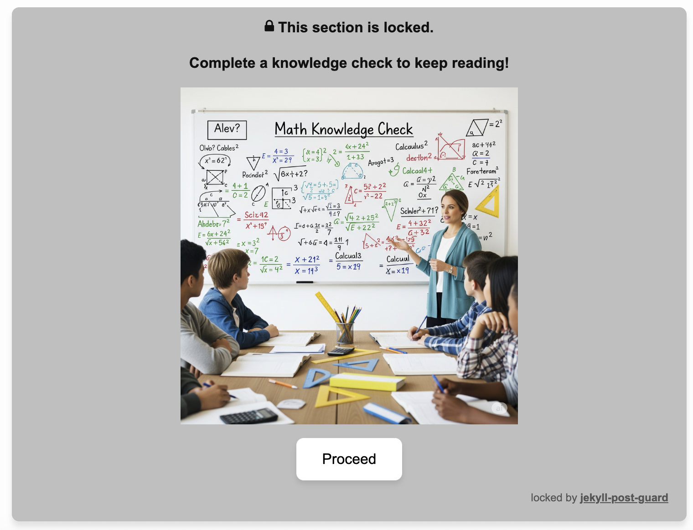
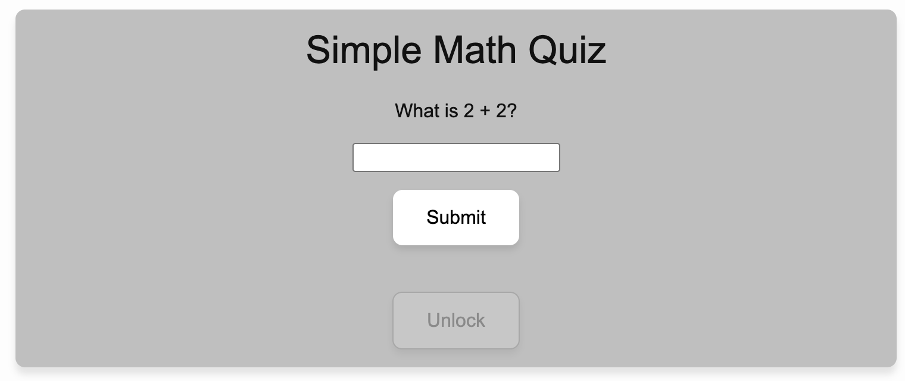

# jekyll-post-guard

The repository hosts code for a plugin for [Jekyll based sites](https://jekyllrb.com/) that adds a lock features to articles.

> [!NOTE]
> Head to [jekyll-post-guard.szonov.com](http://jekyll-post-guard.szonov.com) to see a live demo of this plugin!

> [!NOTE]
> A more detailed README with motivation and potential use cases of this plugin is incoming. More lock variants will be added too. 

 

## How to use

### 1. Import the plugin 

Copy the plugin folder `jekyll-post-gaurd` from this repository `lib` directory into your site's `_plugin` folder.

### 2. Copy the `locks` directory from this repository to your site's root folder. 

### 3. Specify `locks` directory in your `_config.yml`

In your site's root `_config.yml`, specify the directory of the newly added `locks` folder via `lock_dir: locks`.

### 4. Modify your `post.html` layout

Due to the lock feature being added to posts, make sure your modify your `post.html` in your [layout directory](https://jekyllrb.com/docs/step-by-step/04-layouts/) to filter the `content` via `| lock` operation since this plugin is a [filter](https://jekyllrb.com/docs/plugins/filters/). Here is a `before` / `after` for a sample layout page (yours may be different).


<table>
<tr>
<td> Before </td> <td> After </td>
</tr>
<tr>
<td>


```html
---
layout: default
---
<div class="post">
    <article class="post-content">
        {{ content }}
    </article>
</div>
```

</td>
<td>
    
```html
---
layout: default
---
<div class="post">
    <article class="post-content">
        {{ content | lock }}
    </article>
</div>
```
</td>
</tr>
</table>

### 5. Copy lock font folder folder to your `css`

As part of the generated html, by this filter, we use a "lock" emoji. We store this font within `lock_font`, in the root of this directory. Copy `lock_font` to the `css` directory located in the root of your jekyll site's folder.


### 6. Modify your `home` layout

This layout is the one where all your posts are listed:

```html
---
layout: default
---
<head>
    <link rel="stylesheet" href="/css/lock_font/lock_icon_style.css">
</head>
```

This step will vary based on the details of your Jekyll theme. The point is to add a lock emoji to the title of your post so that it is distinguished from other posts as having locked content. For the layout in this repository's `test_site` website I modified `home.html` layout by adding 

```html

    <span class="icon-lock"></span>

```
below
```html
...
<div style="display: inline">
    <div style="display: inline-block;">
        
            <span class="icon-lock"></span>
        
    </div>
    <div style="display: inline-block;">
        <a class="post-link" href="{{ post.url | relative_url }}">
            {{ post.title | escape }}
        </a>
    </div>
</div>
...
```

A sample picture of the resultant list of posts in the home page where the first one is locked:



### 7. Create a lock

Below is a demonstration of a simple lock


You will notice that there are two stages to the lock. The first is the "intro" which warns the reader that the section is locked and prepares them for the upcoming activity. Once the reader agrees to "proceed" then they are redirected to the activity which in this case is simple math question. Only if the reader completes the activity correctly, will the lock dissapear and will the locked content be displayed for the reader.

| Intro    | Activity |
| -------- | ------- |
|   |     |

To create a lock you must create a folder within your `locks` directory named after the name of your future lock. The one pictured above you can find as a sample within this repository's `locks` and it is called `basic`.

Within the lock folder (e.g. within `basic`) you must create two folders (`intro` and `activity`) with the html files named `lock.html` and `activity.html` (respectively):

```
├── locks
│   └── basic
│       ├── activity
│       │   └── activity.html
│       └── intro
│           └── lock.html
```

#### `intro/lock.html`:
Must have a script block as follows:
```html
<script>
    function unlockBox() {/*replace*/}
</script>
```
as the plugin in this repository requires this "hook" to replace with code that will help transition the user fro the into to the activity. The `unlockBox()` needs to be connected to some sort of button so that the user can activate the transition:

```html
<button class="smooth-button" onclick="unlockBox()">Proceed</button>
```

#### `activity/activity.html`

The `activity.html` must also include the script block that will allow the user to transition from the lock to the locked content
```html
<script>
    function unlockBox() {/*replace*/}
</script>
```
along with an associated button:
```html
<button class="smooth-button" onclick="unlockBox()">Proceed</button>
```

<hr>

Common to both `intro/lock.html` and `activity/activity.html` is that you can include additional resource files like images and css within the folders for a more complicated layout:
```
├── locks
│   └── basic
│       ├── activity
│       │   ├── activity.html
│       │   └── style.css
│       └── intro
│           ├── assets
│           │   └── check.png
│           ├── lock_font
│           │   ├── fonts
│           │   │   ├── icomoon.eot
│           │   │   ├── icomoon.svg
│           │   │   ├── icomoon.ttf
│           │   │   └── icomoon.woff
│           │   └── lock_icon_style.css
│           ├── lock.html
│           └── style.css
```
When linking the resources within `activity.html` or `lock.html`, make sure to use relative URLs like
```html

```

Play around with the `basic` example here to test things out. Chatgpt can be very helpful in generating locks if your html/css skill are lacking.

> [!WARNING]
> Make sure to design your lock intro and activity to look good and work on all devices (desktop, mobile, mac, android, windows, chrome, firefox...)


### 7. Add the lock to your post.

Modify the post header to include `locked: true` which is false by default if not specified:

```
---
layout: post
title:  "Welcome to Jekyll!"
date:   2022-11-12 16:27:06 -0600
categories: jekyll update
locked: true
---
```

Within the post's markdown text use the `<!--lock..` to wrap the text to be locked away. We specify which lock we want to use from the `_lock` directory via `<!--lock:{"data":"basic"}-->` (this line must directly follow `<!--lock_start-->`).

```
...
locked: true
---

Introductory, non locked off text.

<!--lock_start-->
<!--lock:{"data":"basic"}-->

Text that will now be locked off in your blog post.

<!--lock_end-->
...
```

You can also specify `fade_time` (e.g. `<!--lock:{"data":"desktop_only","fade_time":0}-->`) to specify how quick the locked of content will appear once the activity is complete. 

> [!WARNING]
> Jekyll is a static site generator and due to this all the locking and unlocking happens on the user's browser. Therefore, the locked content is not encrypted and can be accessed relatively easily by someone who knows how to debug html code. However, the average user does not 
